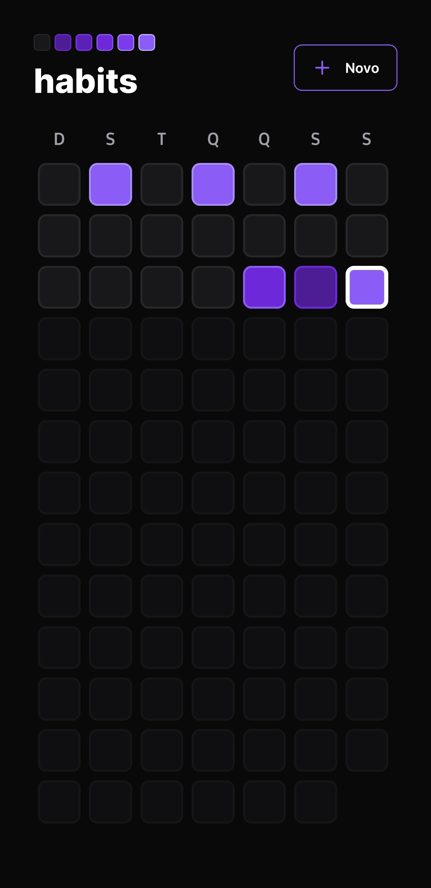
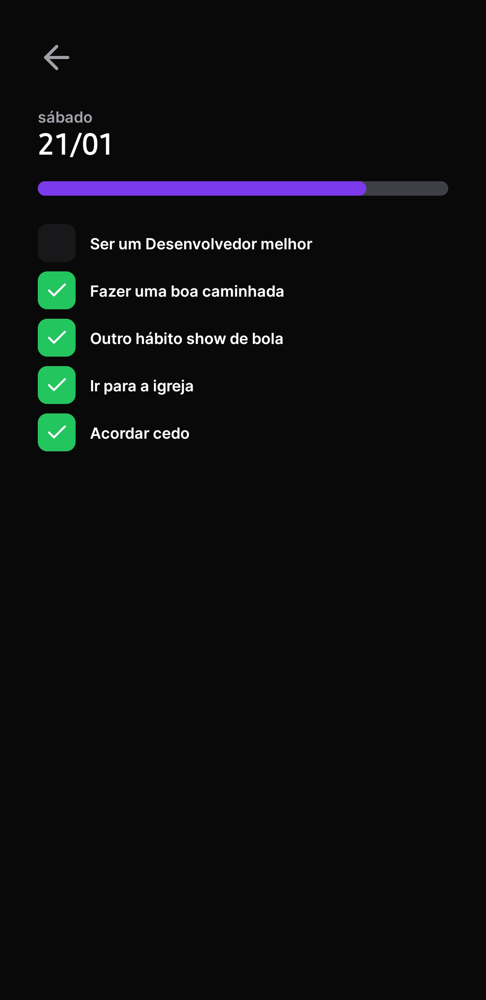
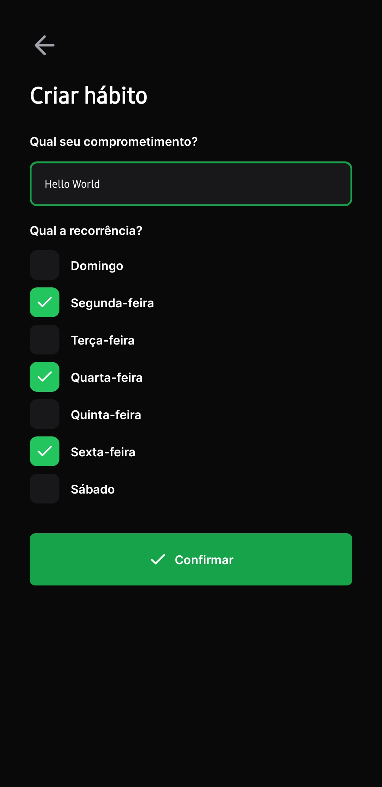

<h1 align="center">NLW Setup [Ignite]</h1>

Vamos desenvolver uma aplicação completa, de ponta a ponta, usando `TypeScript`, usando `Node.JS`, `React.JS`, `React Native`.

- **Node.JS**: Em resumo leva JS para o Backend, nos possibilta conexão com banco de dados, criação de API's completas, e ainda é possível usar para `IoT`;
- **TS**: TypeScript é um superset (não um framework) do JS que traz a tipagem estática ao JS, melhor inteligência e identificação de erros em nível de código antes do projeto ir para produção;

<h3 align="center">Preview Mobile</h3>
<p align="center">
  
  
  
<p>
<h3 align="center">Preview Web</h3>


# Server

Localização: `nlw-setup-ignite/server`;

Vamos desenvolver uma API RESTful, usando `fastify`, por ser similar ao `express`, porém tem sido mais performático.

## Instalações necesárias 🔌

- **npm i fastify**
- **npm i typescript -D**
- **npx tsc --init** (é um alias para: npx typescript --init)
- **npm i tsx -D** (Essa biblioteca permite executar um arquivo do Node com TS sem precisar fazer qualquer tipo de conversão do arquivo)
  - Para verficar, use o comando **npx tsx src/server.ts**, ou melhor crie um script no `package.json`, use a flag `watch` para que cada alteração seja apresentada em tempo real;

```
"scripts": {
    "dev": "tsx watch src/server.ts"
  }
```

### Banco de Dados

Como banco de dados, vamos usar um `ORM`, por ser mais rápido no momento de desenvolvimento, o ORM escolhido foi `Prisma`.

- **npm i prisma -D** (prisma com depedência de desenvolvimento);
- **npm i @prisma/client** (sem dependência de desenvolvimento);

Para iniciar com prisma, vamos usar o seguinte comando com a flag abaixo:

- **npx prisma init --datasource-provider SQLite**
  - Banco de dados: SQLite;
- **npx prisma migrate dev** (Descreva o que foi feito: create table habits);
  - Da mesma forma que temos Git para versionamento de código, temos as `migrations` para versionamento no contexto de banco de dados
- **npx prisma studio** (Para visualizar o DB com prisma no navegador sem precisar instalar nada)

Sempre que for necessário realizar alguma alteração na estrutura do banco de dados, sua modelagem (o model), e estivermos usando o prisma, devemos usar o comando **npx prisma migrate dev** e dar um nome para a migration e automaticamente será gerado uma nova migration (versão do DB).

#### Foreign Keys

EM DBs, trabalhamos muito com chaves estrangeiras, que trabalha com os relacionamentos de entidades (tabelas), sendo algo até básico do SQL. Como estamos usando o Prisma, este é um exemplo de modelo usado:

```prisma
model DayHabit {
  id String @id @default(uuid())

  day_id   String
  habit_id String

  day   Day   @relation(fields: [day_id], references: [id])
  habit Habit @relation(fields: [habit_id], references: [id])

  @@unique([day_id, habit_id])
  @@map("day_habits")
}
```

Usamos @relation() para relacionar uma tabela com outra por meio de seus campos (fields) e referência (references). Com isso, o prisma entende como o relacionamento entre essas entidades se dá e já faz o relacionamento inverso como pode ser visto na tabela Day, onde temos **DayHabit DayHabit[]** que foi gerado pelo Prisma:

```
model Day {
  id       String     @id @default(uuid())
  date     DateTime
  DayHabits DayHabit[]

  @@unique([date])
  @@map("days")
}
```

#### Visualização do banco de dados

Vamos instalar outra ferramenta (de desenvolvimento), para quem gosta de fazer a visualização dos bancos de dados, por meio de diagramas por exemplo:

- **npm i -D prisma-erd-generator @mermaid-js/mermaid-cli**

**fonte**: https://www.npmjs.com/package/prisma-erd-generator

São duas dependências de desenvolvimento que vão nos ajudar a visualizar o banco de dados em prisma (nesse caso, com SQLite) em formato de diagrama. Depois de instalar, basta colar o script onde estamos modelando nosso DB (schema.prisma):

```
generator erd {
  provider = "prisma-erd-generator"
}
```

E usar o comando no terminal:

- **npx prisma generate**

Isso vai gerar um arquivo `ERD.svg`, e abrindo no browser, podemos ver como está ficando o relacionamento das nossas entidades no DB criado (Entidade-relacionamento).

### Banco de Dados em ambiente de produção

Vamos trabalhar com o `SEED` (um populador de banco de dados) para popular nosso banco de dados enquanto estamos desenvolvendo, assim a gente pode ver como os dados vão estar se relacionando, além de não trabalhar com um banco de dados vázio.

Para isso, basta criar um arquivo seed.ts com a seguinte estrutura:

```TS
import { PrismaClient } from '@prisma/client'
const prisma = new PrismaClient()
async function main() {

}
main()
  .then(async () => {
    await prisma.$disconnect()
  })
  .catch(async (e) => {
    console.error(e)
    await prisma.$disconnect()
    process.exit(1)
  })

```

E depois no `package.json`, criar o script:

```json
"prisma": {
    "seed": "tsx prisma/seed.ts"
  }
```

Para finalizar este tópico, basta executar o comando no terminal:

- npx prisma db seed
- E depois, **npx prisma studio** para conferir se tudo deu certo. Obs.: Use o não esqueça do arquivo: `seed.ts`

**Fonte**: https://www.prisma.io/docs/guides/database/seed-database

### Rotas

Após estruturar bem nosso banco de dados, vamos trabalhar com as rotas do nosso back-end. Vamos começar criando uma pasta `lib` e dentro dela criar um arquivo `prisma.ts`, e o motivo disso? nós vamos precisar fazer muitas requisições ao nosso banco de dados.

Além disso, vamos criar também um arquivo para trabalhar com as rotas da aplicação. Dentro de `src` também. Sempre que vamos fazer uma requisição na aplicação conseguimos obter várias informações:

- **body**: corpo da requisição e de onde buscamos informações, como criação de usuário, por exemplo;
- **params**: se referem aos parâmetros (na URL) da rota;
- **query**: para paginação, filtros, por exemplo, nas rotas;

Como vamos precisar fazer validações no back-end e estamos usando TS, vamos instalar a biblioteca `zod`:

- **npm i zod**

Como vamos trabalhar com datas no projeto, a biblioteca `dayjs`, muito boa para trabalha com datas de uma forma muito boa (e vai nos ajudar muito para nós que vamos precisar listar várias operações usando datas)

### CORS

Nenhuma aplicação front-end consegue acessar o back-end, por conta disso precisamos usar o `CORS` (**CROSS-ORIGIN RESOURCE SHARING** é mecanismo de segurança que diz quais aplicações podem acessar dados do back-end criado). Neste caso, vamos usar o cors integrado com fastifiy que é biblioteca que estamos usando

- **npm i @fastify/cors**

### Route Params

Sempre que usamos `:` dentro de uma rota, estamos falando de parâmentros de rotas (route params), que são parâmetros que vem no endereço da rota, como um id de algo, no caso dessa aplicação seria o id de um hábito, por exemplo.

# Web

Localização: `nlw-setup-ignite/web`;

## Instalações necessárias 🔌

```
npm create vite@latest
```

- web
- React
- TypeScript
- npm i

- **Componentes**: Tudo o que queremos reaproveitar/isolar na aplicação;
- **propriedades**: É uma informação enviada para modificar um componente, seja visual ou comportamentalmente;

## Estilização

Vamos usar o `Tailwind CSS`

- npm i tailwindcss -D
- npm i postcss -D
- npm i autoprefixer -D

Vamos a alguns detalhes importante para salvar o projeto.

- Criar Arquivo `tailwind.config.cjs`, com o seguinte script:

  ```
  /** @type {import('tailwindcss').Config} */
  module.exports = {
  content: [
    './src/**/*.tsx',
    './index.html'
  ],
  theme: {
    extend: {},
  },
  plugins: [],
  }
  ```

- Criar Arquivo `postcss.cjs`, com o seguinte script:

  ```
  module.exports = {
    plugins: {
      tailwindcss: {},
      autoprefixer: {},
    },
  }
  ```

- Dentro de src, criar pasta `styles`, com arquivo `global.css`, com o seguinte script:

  ```
  @tailwind base;
  @tailwind utilities;
  @tailwind components;

  ```

Pronto, configurações iniciais prontas!

### Ícones

Vamos usar o `phosphor icons`

- **npm i phosphor-react**

### Estilizando campo de datas

Vamos instalar o `day.js` para trabalhar com a função `generateDatesFromYearBegnning()` para gerar todas as datas desde o início do ano de maneira automatica

- **npm i dayjs**

### Modal de criação de hábitos

Vamos fazer a instalção do `radix-ui`, segue o comando para terminal:

- **npm i @radix-ui/react-dialog**
- **npm i @radix-ui/react-popover**
- **npm i @radix-ui/react-checkbox**

**Para barra de progresso**: instalação do `clsx` para trabalhar com classes condicionais:

- **npm i clsx**

## Conectando a API

No próprio JS, nós temos o fetch-API (que é uma API nativa dos browsers, que permite fazer chamadas HTTP), porém, vamos usar o axios por ser mais minimalista em quantidade de código:

- **npm i axios**

Dentro de `src/lib`, criar arquivo `axios.ts` com este script:

```TS
import axios from "axios";

export const api = axios.create({
  baseURL: 'http://localhost:3333'
})
```

## Finalizando o WEB

- Toggle na conexão com API;
- Estilizando a experiência da aplicação com transições e focus;
- Levando o projeto para o próximo nível:
  - Ter autenticação (por usuário), dicas: Firebase, Auth0;
  - Ter notificações push;
  - Ter service workers;
  - Ter um perfil público com gráfico de resumo;

# Mobile

Localização: `nlw-setup-ignite/mobile`;

- **React Native**: nos permite criar apps mobile/desktop para Android, iOS, Windows, MacOS, Smartwatch, etc...

Sim, React Native é uma escolha segura para o desenvolvimento de aplicações nativas

Com RN, temos uma única base de código em JS. Apesar de ser cross-platform, o RN renderiza a aplicação de forma nativa, empacotando o bundle tanto para Android quanto para iOS, usando as APIs nativas de cada S.O.

O desenvolvimento em RN é de forma declarativa e com interfaces nativas.

Vamos usar o **Expo**

- **Expo**: Quando vamos desenvolver uma aplicação mobile, temos a preocupação com o ambiente de desenvolvimento, de conhecer bem a estrutura organizacional, seja do Android ou iOS. Mesmo com RN, essa preocupação ainda existe, e é aqui que entra o Expo, que tem o objetivo de tornar fácil e rápido o ambiente de desenvolvimento, deixando todo o foco no desenvolvimento da aplicação sem se preocupar tanto com a configuração do Android ou iOS.

O Expo é muito seguro para ambiente profissional, trazendo automatização

## Instalações necesárias 🔌

```
npm install -g expo-cli
expo --version

OR

npx create-expo-app mobile --template
```

- Blank TypeScript

Depois disso, é necessário instalar:

```
npx expo i react-native-svg (Pois o RN não trabalha com SVG por padrão)
npm i react-native-svg-transformer --save-dev
```

Depois disso, precisamos fazer algumas configuações básicas, a primeira na raiz do projeto, criando o arquivo `metro.config.js`:

```js
const { getDefaultConfig } = require("expo/metro-config");

module.exports = (() => {
  const config = getDefaultConfig(__dirname);

  const { transformer, resolver } = config;

  config.transformer = {
    ...transformer,
    babelTransformerPath: require.resolve("react-native-svg-transformer"),
  };
  config.resolver = {
    ...resolver,
    assetExts: resolver.assetExts.filter((ext) => ext !== "svg"),
    sourceExts: [...resolver.sourceExts, "svg"],
  };

  return config;
})();
```

e dentro de `src/@types`, mas vamos criar `app.d.ts`, e usar o script:

```TS
/// <reference types="nativewind/types" />
```

E depois, dentro dessa mesma pasta, arquivo `svg.d.ts`:

```TS
declare module "*.svg" {
  import React from 'react';
  import { SvgProps } from "react-native-svg";
  const content: React.FC<SvgProps>;
  export default content;
}
```

Vamos instalar também o `dayjs` para trabalhar com datas de forma automatizada:

- **npm i dayjs**

E podemos garantir que a aplicação vai seguir o modelo `pt-BR`, criando arquivo `dayjs.ts` em `src/lib`,com o seguinte script:

```TS
import dayjs from 'dayjs';
import 'dayjs/locale/pt-br';

dayjs.locale('pt-br');
```

### Executar

É necessário instalar `expo go` no smartphone para rodar a aplicação de forma virtual (); Ou instalar Android Studio e iniciar a emulação.

- **npx expo start** (Após usar este comando, escolha sua opção de virtualização do App);

## Estilizações

### Fontes

Vamos instalar algumas fontes personalizadas no projeto

- npx expo install expo-font @expo-google-fonts/inter

### Nativewind

Vamos instalar o Tailwind no projeto. Sim, o mesmo tailwind usado no React.JS pode ser usado no RN e vamos usar aqui:

- **npm i nativewind**
- **npm i tailwindcss --save-dev**
- **npx tailwindcss init** (Para iniciar o arquivo: `tailwind.config.js` que foi criado)

Após isso, vamos configurar o arquivo criado com este script:

```JS
/** @type {import('tailwindcss').Config} */
module.exports = {
  content: [
    "./App.{js,jsx,ts,tsx}",
    "./src/**/*.{js,jsx,ts,tsx}"
  ],
  theme: {
    extend: {
      colors: {
        background: '#09090a',
      },
      fontFamily: {
        regular: 'Inter_400Regular',
        semibold: 'Inter_600SemiBold',
        bold: 'Inter_700Bold',
        extrabold: 'Inter_800ExtraBold'
      }
    },
  },
  plugins: [],
}
```

A partir de agora, vamos estilizar nosso projeto com `NativeWind`

## Navegação

Para implementar navegação em aplicações mobile com RN, temos o `React Navigation`. Vamos instalar o core:

- **npm i @react-navigation/native**

E depois de suas dependências logo após:

- **npx expo install react-native-screens react-native-safe-area-context**

E para finalizar, temos o `native-stack`

- **npm i @react-navigation/native-stack**

## Conectando a API

No próprio JS, nós temos fetch, porém, vamos usar o axios:

- **npm i axios**

Dentro de `src/lib`, criar arquivo `axios.ts`, com este script:

```TS
import axios from "axios";

export const api = axios.create({
  baseURL: 'http://<ip da sua máquina>:3333'
})

```

## Animações em RN

Vamos instalar o `react-native-animated` pela documentação do expo

- **npx expo install react-native-reanimated**

**DICA**: Uma recomendação é usar o seguinte comando (para garantir que limpe o cache do bundle e execute a aplicação com todas as recomendações):

- **npx expo start --clear**

## Finalizando o Mobile

- Levando o projeto para o próximo nível:
  - Ter autenticação (por usuário), dicas: Firebase, Auth0;
  - Ter notificações push;
  - Ter service workers;
  - Ter um perfil público com gráfico de resumo;
